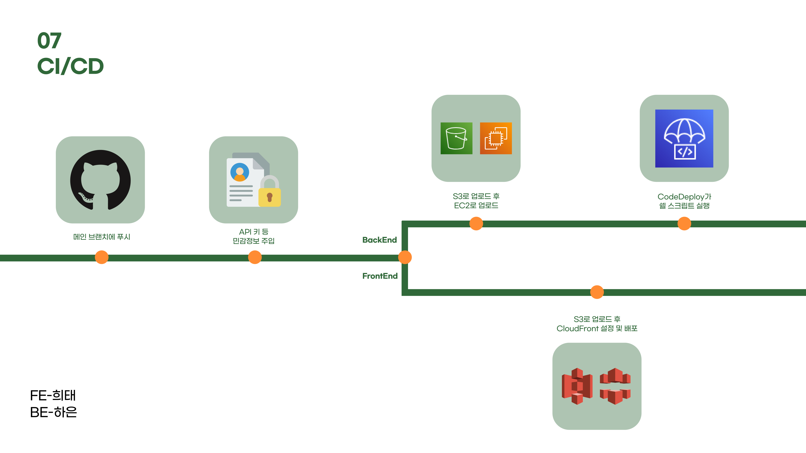

# 개요

[2차 팀 프로젝트](https://github.com/JJHHYB/deepvalley-front)에서 급하게 Infinite Scroll을 적용해야 하는 상황이 있었고, 당시엔 깊이 고민하지 못한 채 구현했다. 이번 포스팅에서는 무한 스크롤의 개념과 다양한 구현 방법, 그리고 성능 최적화 방안까지 상세히 살펴보려고 한다.

# Infinite Scroll이란?

사용자가 페이지를 아래로 스크롤할 때 콘텐츠를 지속적으로 로드하는 기술이다. 모바일 환경에 최적화된 UX 패턴이며, 페이지네이션(Pagination)과 비교했을 때 별도의 페이지 이동 없이 연속적인 데이터 로딩이 가능하다는 장점이 있다.

여러가지 구현 방식이 있지만 대표적으로 두 가지가 있다.

**Scroll 이벤트 감지 방식**

**Intersection Observer 방식**
각각의 방법을 살펴보면서 장단점과 최적화 방안을 고민해보자.

## Scroll 이벤트 방식

가장 직관적인 방법은 `window.scroll` 이벤트를 감지하는 것이다. 특정 위치에 도달하면 API 요청을 통해 데이터를 추가 로드하는 방식이다.

```js
function InfiniteScroll() {
  const fetchData = async () => {
    // API 호출 로직
  };

  const handleScroll = () => {
    const { documentElement } = document;
    const scrollHeight = documentElement.scrollHeight;
    const scrollTop = documentElement.scrollTop;
    const clientHeight = documentElement.clientHeight;

    if (scrollTop + clientHeight >= scrollHeight) {
      fetchData();
    }
  };

  useEffect(() => {
    window.addEventListener("scroll", handleScroll);
    return () => {
      window.removeEventListener("scroll", handleScroll);
    };
  }, []);
}
```

### 문제점

이 방법은 간단하고 직관적이지만, `scroll` 이벤트가 너무 자주 발생하여 성능 저하를 유발할 수 있다. 특히, 이런 블로그 형태나 실시간으로 fetch를 하는 지도API를 사용하는 경우 감지하는 이벤트가 계속 호출되기 때문에 렌더링 성능에 영향을 미칠 수 있다.

### 해결책

이를 개선하기 위해 Debounce 또는 Throttling 기법을 적용할 수 있다.

&nbsp; `Debounce` 일정 시간 동안 이벤트가 연속해서 발생하면 마지막 이벤트만 실행

&nbsp; `Throttling` 지정한 시간 간격마다 이벤트 실행

하지만 여전히 스크롤 이벤트를 감지해야 하기 때문에 불필요한 연산이 발생할 가능성이 있다.

## Intersection Observer 방식

이러한 문제를 해결할 수 있는 대안으로 `Intersection Observer`를 사용할 수 있다. 특정 요소가 뷰포트에 들어오는지를 감지하여 데이터를 로드하는 방식이다.

## 전체 코드

```js
import React, { useState, useEffect } from "react";
import { useInView } from "react-intersection-observer";

const InfiniteScroll = () => {
  const [items, setItems] = useState([]);
  const [page, setPage] = useState(1);
  const [ref, inView] = useInView();

  const fetchMoreData = async () => {
    const newItems = Array.from({ length: 10 }, (_, i) => `Item ${i + (page - 1) * 10 + 1}`);
    setItems((prevItems) => [...prevItems, ...newItems]);
    setPage((prevPage) => prevPage + 1);
  };

  useEffect(() => {
    if (inView) {
      fetchMoreData();
    }
  }, [inView]);

  return (
    <div>
      <ul>
        {items.map((item, index) => (
          <li key={index}>{item}</li>
        ))}
      </ul>
      {/* Intersection Observer 타겟 요소 */}
      <div ref={ref} />
    </div>
  );
};

export default InfiniteScroll;
```

### Custom Hook 설정

&nbsp; `Intersection Observer`를 활용하여 커스텀 훅을 특정 DOM 요소가 화면에 나타나는지를 감지하는 커스텀 훅을 구현한다.

- useInView
  특정 DOM 요소가 뷰포트에 진입했는지 여부 감지
- ref
  관찰할 DOM 요소에 연결
- inview
  요소가 뷰포트에 들어왔는지 여부를 나타냄

```js
const [ref, inView] = useInView();
```


이런식으로 특정 요소를 감지한다.

### 데이터 로드

&nbsp;`useEffect`를 사용하여 inView 값이 변경될 때마다 데이터를 로드한다.

요소가 뷰포트에 들어오면 `fetchMoreData`가 실행

```jsx
useEffect(() => {
  if (inView) {
    fetchMoreData();
  }
}, [inView]);
```

### 사용 예시

```js
const SampleList = () => {
  const dispatch = useDispatch();
  const { pageNumber, totalPageCount, list } = useSelector(selector);

  useEffect(() => {
    dispatch(fetch());
    return () => dispatch(clear());
  }, []);

  return (
    <InfiniteScroll
      isLoaded={list.length !== 0}
      pageNumber={pageNumber}
      totalPageCount={totalPageCount}
      trigger={() => dispatch(fetch())}
    >
      {list.map((item, index) => (
        <div key={index}>{item}</div>
      ))}
    </InfiniteScroll>
  );
};
```

## 마무리하며

이번 포스팅에서는 2차 팀 프로젝트에서 급하게 적용했던 Infinite Scroll을 다시 살펴보았다. 당시에는 단순한 scroll 이벤트 감지를 사용했지만, Intersection Observer 방식이 더 적절한 방법임을 알게 되었다. 프리페치(pre-fetching)나 Skeleton UI를 통해 최적화를 시킬 수도 있지만 일단은 원시적인 방법으로 찾아보았다. 앞으로는 성능 최적화와 UX까지 고려한 무한 스크롤 구현을 고민해봐야겠다.

## 출처

사진
https://velog.io/@oneook/Intersection-Observer-%EB%B7%B0%ED%8F%AC%ED%8A%B8-%EB%85%B8%EC%B6%9C-%EA%B0%90%EC%A7%80-APIs
http://brianyang.com/infinite-scroll-techniques-in-react/
